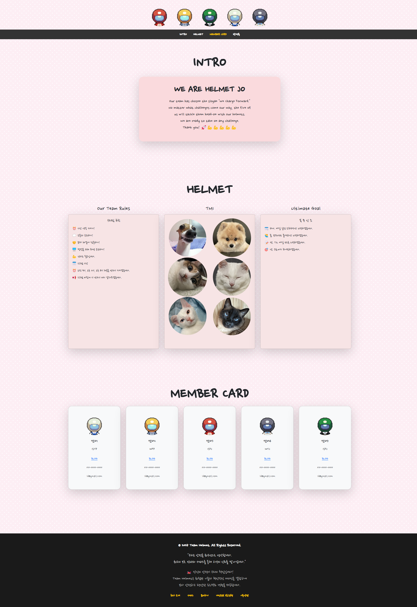
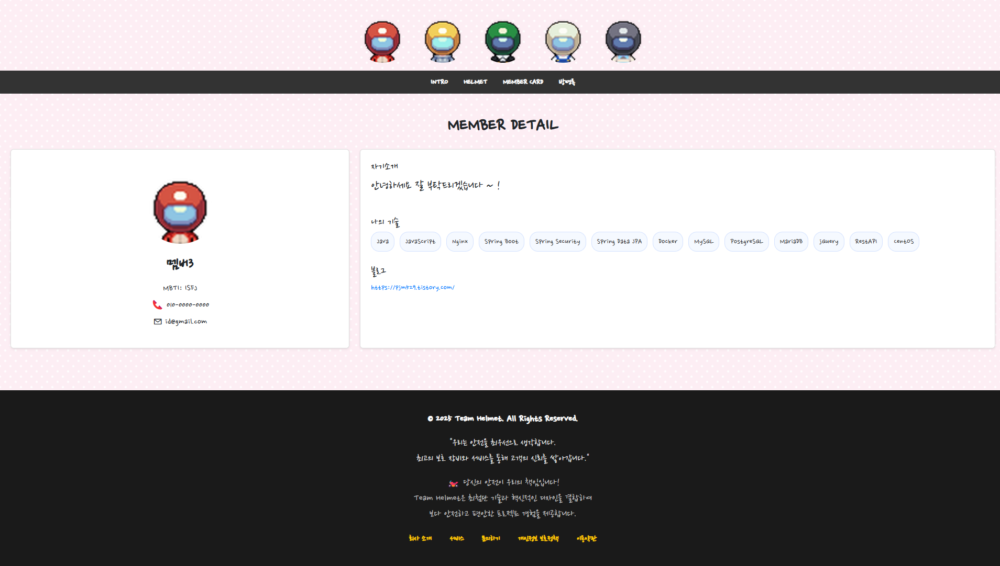
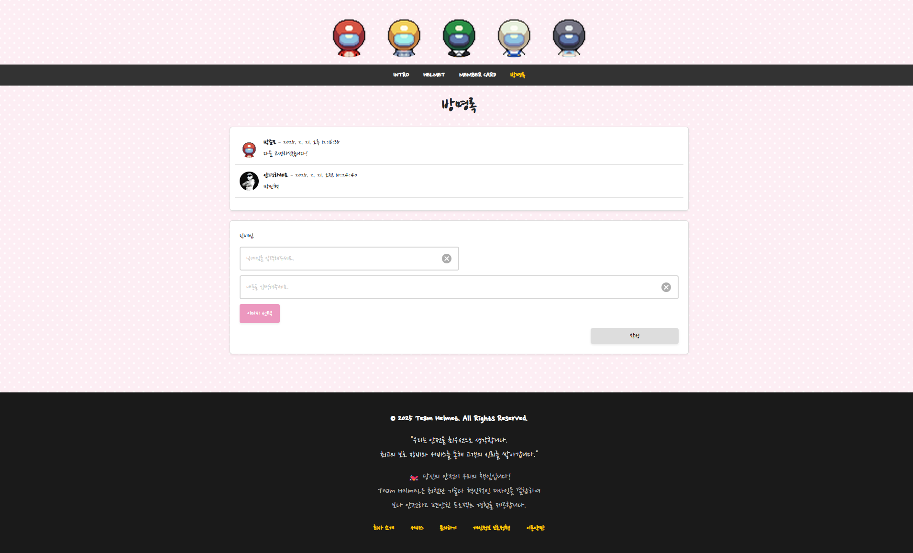
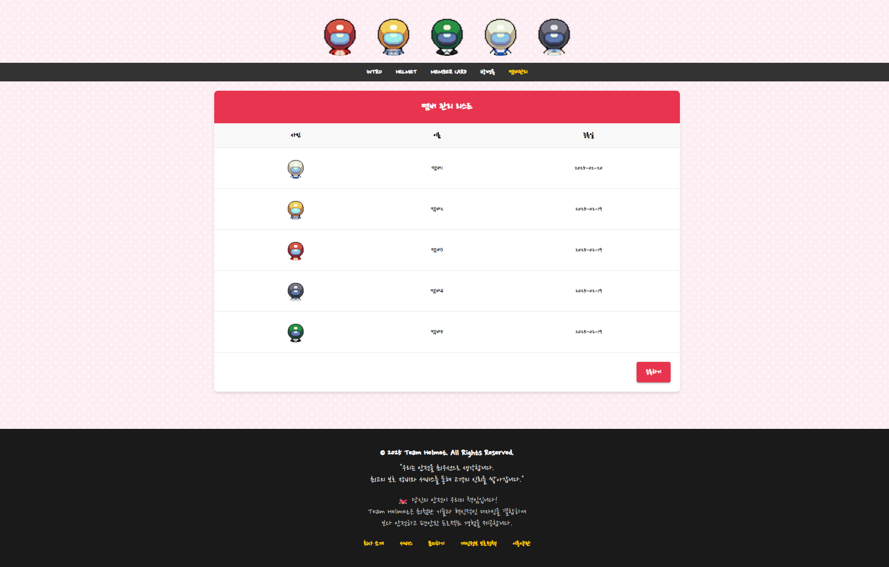
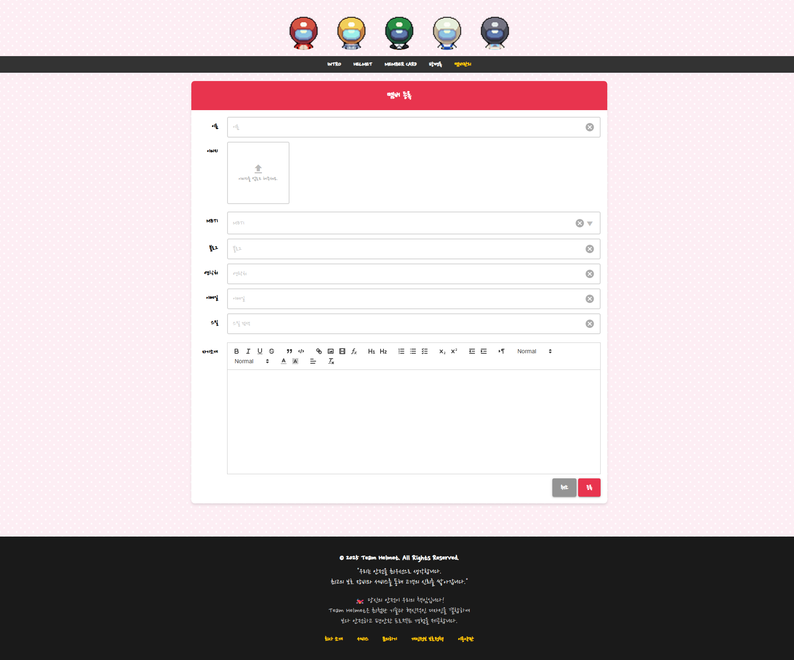

# 팀프로젝트
팀 소개페이지

## 차례

[프로젝트 소개](#프로젝트-소개)  
[주요 기능](#주요-기능)    

## 프로젝트 소개

스파르타 코딩클럽 내일배움캠프 팀 소개페이지

### 사용언어

### 개발환경

### 구성원

- 박민혁 : [https://github.com/SmartParkMinHyuk](https://github.com/SmartParkMinHyuk)
- 박준모 : [https://github.com/pjm529](https://github.com/pjm529)
- 손민수 : [https://github.com/Sonny-in-1999](https://github.com/Sonny-in-1999)
- 이진아 : [https://github.com/jinaLee11](https://github.com/jinaLee11)
- 이한나 : [https://github.com/seseseseo](https://github.com/seseseseo)

### 기간

- 2025-02-17 ~ 2025-02-20

## 주요 기능

### 메인페이지

### 멤버 상세

### 방명록

### 관리자 회원 목록

### 관리자 회원 생성

